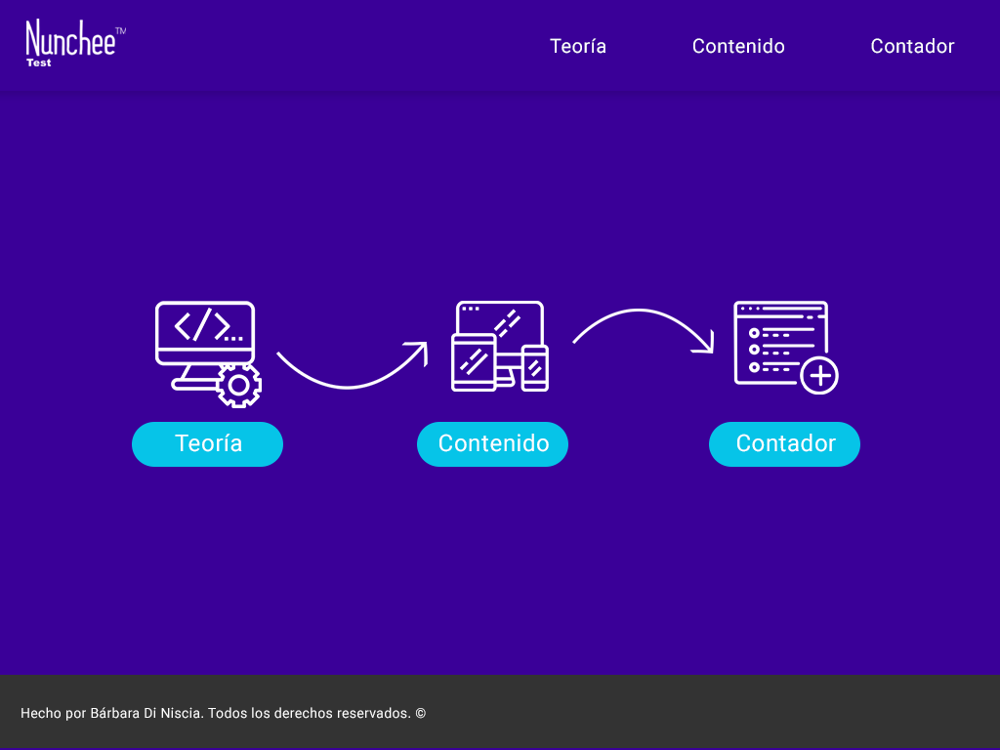
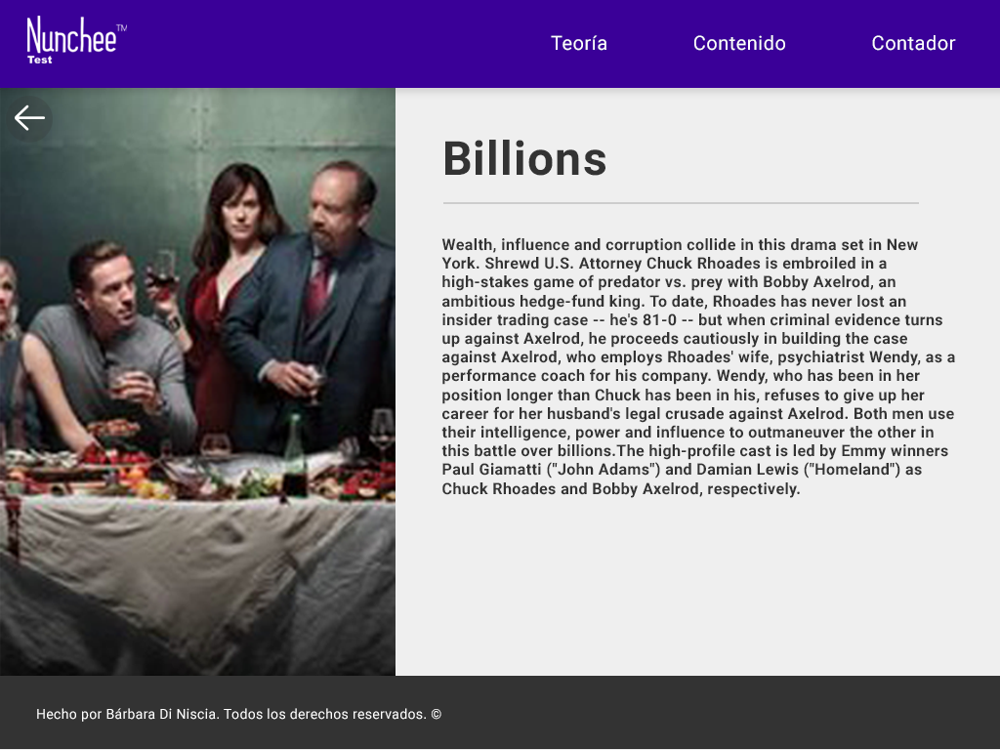

# Test
## Tecnologías 💻
Se utilizó:
 - [x] JavaScript 🏗️
 - [x] React ⚛️
 - [x] React Hooks ⚓
 - [x] SASS 🎀
 - [x] Bootstrap 🅱️
 - [x] React-router 🛣️
 - [x] Redux 🟣
 - [x] React-Redux 🟪
 - [x] React-loader-spinner 💫
 - [x] Cors-anywhere 🔑
 - [x] Flexbox 💪

## Playlist 📺

Primero se diseñó el estilo de la Playlist y se pensó el flujo de la app. 

- Prototipo en PSD: 
	- Un Home, ya que la prueba contiene varias partes, sería más fácil de navegar, con el un estilo parecido a la de su brand y algunos elementos de su landing:

	- El look de la vista de como se vería los detalles de la info:

## Deploy 🚀
En el siguiente link puedes ver el link del [deploy]()